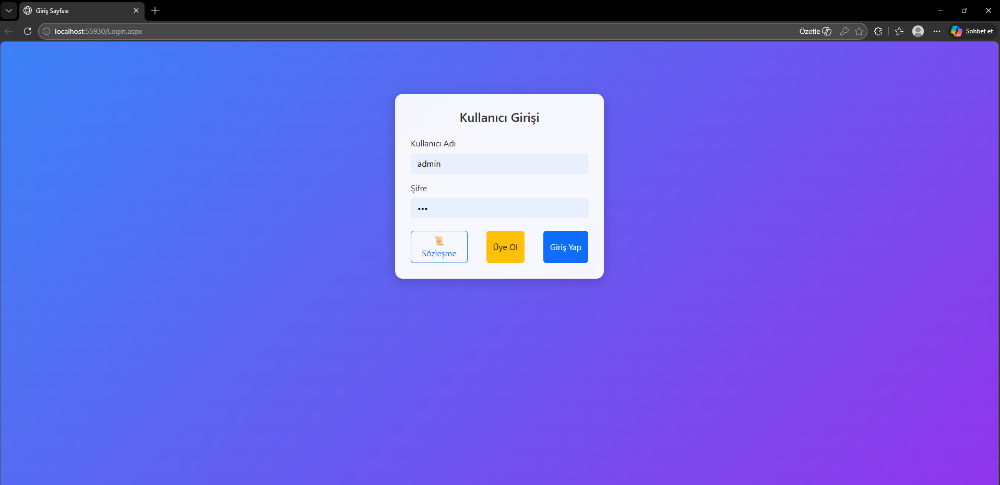
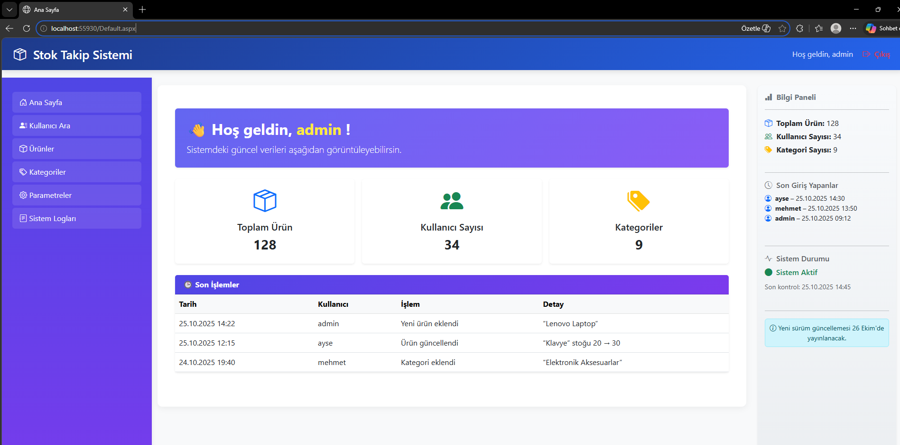
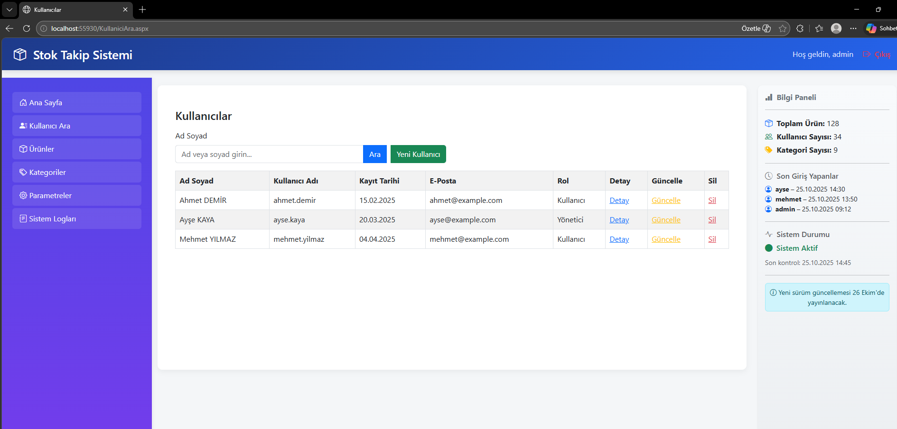

# 📦 Stok Takip Sistemi

ASP.NET Web Forms ve C# kullanılarak geliştirilmiş, modal tabanlı bir stok takip web uygulaması.

---

## 🚀 Özellikler

- 🔐 Kullanıcı girişi (Login)
- 📦 Ürün ekleme, düzenleme ve silme
- 🗂️ Kategori yönetimi
- 🔍 Kullanıcı arama
- ⚙️ Parametre yönetimi
- 📋 Sistem logları takibi
- 🪟 Modal tabanlı kullanıcı arayüzü

---

## 🛠️ Kullanılan Teknolojiler

- **C# / ASP.NET Web Forms**
- **HTML / CSS / JavaScript**
- **SQL Server**
- **.NET Framework 4.8**

---

## 📸 Ekran Görüntüleri

| | | |
|---|---|---|
|  |  |  |

---

## ⚙️ Kurulum

1. Repoyu klonla:
```bash
git clone https://github.com/SefaMertAslan/Stok-Takip-Sistemi.git
```

2. Visual Studio'da `webodev3.sln` dosyasını aç

3. `Web.config` dosyasında veritabanı bağlantı bilgilerini güncelle

4. Projeyi çalıştır (**F5**)

---

## 👤 Geliştirici

**Sefa Mert Aslan** — Bilgisayar Mühendisliği Öğrencisi

[](https://github.com/SefaMertAslan)
